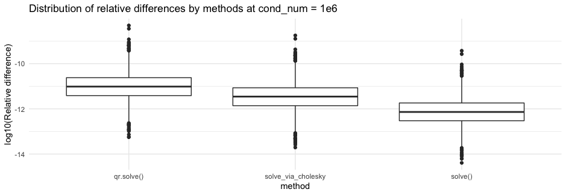

<script type="text/x-mathjax-config">
MathJax.Hub.Config({
  TeX: {
    Macros: {
      bA: "{\\boldsymbol{A}}",
      bx: "{\\boldsymbol{x}}",
      bb: "{\\boldsymbol{b}}"
    }
  }
});
</script>


```{r setup, include=FALSE}
#source(file.path("..", "R", "util.R"))

required_packages <- c("microbenchmark")
#install_and_load_packages(required_packages)
```


# Exercise 1: Comparing different numerical linear algebra algorithms for solving linear systems

In this exercise, we consider the problem of solving a linear system $\bA \bx = \bb$ for $\bx$.
We compare the three methods we learned in the class: LU, Cholesky, and QR decompositions.
(Of course, LU applies to more general systems and QR can be used to solve least squares, but here we focus on positive definite systems.)

## Part A: Racing for solution &mdash; speed comparison 

We first compare their computational speed. 
Fill in the code below and `bench::mark()` the three algorithms.

**Questions:**
What are relative speeds among the algorithms?
Do relative speeds agree with what you expect from the complexity analyses?
If not (quite), why might that be?

**Answers:**
By comparing "min" and "median" outputs from `bench::mark()` among the three algorithms, the fastest to slowest are: solve(A, b), solve_via_cholesky(A, b), and qr.solve(A, b).
From the complexity analyses, the order from fastest to slowest (with positive definite matrix) is Cholesky ($\frac{1}{3}n^3$), LU ($\frac{2}{3}n^3$), and QR ($\frac{4}{3}n^3$),
where n is the `mat_size`
So, it makes sense to see qr.solve(A, b) be the slowest one. Solve(A, b) and solve_via_cholesky are comparable even though the former one is faster than expected.
Indeed, solve() in base R can check the input matrix property via LAPACK, and for our positive definite matrix, solve() will choose the optimal path to find the result.

**Note:**
I misspoke about the R's built-in `chol()` function during the lecture:
when applied to a positive-definite `A`, the function actually returns an _upper-triangular_ matrix `R` such that `t(R) %*% R == A`.

```{r, eval=FALSE}
# Import the `rand_positive_def_matrix` function
source(file.path("R", "random_matrix.R"))

mat_size <- 1024L
A <- rand_positive_def_matrix(mat_size, cond_num = 1e3)
b <- rnorm(mat_size)

solve_via_cholesky <- function(A, b) {
  L <- chol(A)
  y <- forwardsolve(t(L), b)
  return(backsolve(L, y))
}

bench::mark(
  solve(A, b)
)
bench::mark(
  solve_via_cholesky(A, b)
)
bench::mark(
  qr.solve(A, b)
)
```

## Part B: Competition in terms of numerical accuracy/stability

We now compare the three methods in terms of numerical accuracy/stability.
To this end, we set up the following simulation study. 
We first generate a "ground truth" solution vector $\bx_0$.
We then compute an "numerical-error-free" $\bb = \bA \bx_0$ by carrying out the matrix-vector multiplication using the `long double` type, which (on most hardware and compilers) provides [additional 12 bits of precision](https://en.wikipedia.org/wiki/Extended_precision#x86_extended_precision_format).
Of course, the vector $\bb$ computed as such still suffers from numerical errors, but the idea is that the numerical errors from this high-precision matrix-vector multiplication is much smaller than the errors caused by numerically solving $\bA \bx = \bb$ for $\bx$.
We can thus assess the accuracy of the three solvers by comparing the numerically computed $\bx$ to the ground truth $\bx_0$.

### Task &#x2F00;

First compare the outputs of matrix-vector multiplication $\bx \to \bA \bx$ using `double` and `long double` using the provided Rcpp functions.

**Questions:**
What is the relative difference in $\ell^2$-norm? 
How about the coordinate-wise relative differences?
Are the observed magnitudes of the differences what you'd expect?

**Answer:**
The relative difference in $\ell^2$-norm from the below code is in the magnitude of 1e-15.
The coordinate-wise relative differences also in the same magnitude. 
The observed magnitudes of the differences are expected because `matvec_double` 
has a decimal accuracy around 15-16 significant decimal digits while that of `matvec_ldouble` is ~19-20. 
So when the two are compared, we get a digit accuracy of the lower one which is ~15.  


```{r, eval=FALSE}
Rcpp::sourceCpp(file.path("src", "matvec_double.cpp"))
Rcpp::sourceCpp(file.path("src", "matvec_ldouble.cpp"))

set.seed(1918)

mat_size <- 1024L
A <- rand_positive_def_matrix(mat_size, cond_num = 1e3)
x <- rnorm(mat_size)

Ax_double <- matvec_double(A, x)
Ax_ldouble <- matvec_ldouble(A, x)

rel_l2_norm <- norm(matrix(Ax_double - Ax_ldouble, nrow = length(Ax_double))) / norm(matrix(Ax_double, nrow = length(Ax_double)))
coordinate_diff <- abs(Ax_double - Ax_ldouble) / pmax(abs(Ax_double), abs(Ax_ldouble), 1e-10)

```

### Task &#x2F06;

Now randomly generate $\bA$ so that its condition number is $10^6$.
Then solve a positive-definite system $\bA \bx = \bb$ for $\bx$ using the three algorithms and compare their outputs to the ground truth $\bx_0$.

**Questions:**
Which algorithm appears to be more accurate than the others? 
Visually demonstrate your answer.

**Answer:**
For the plot below, solve() with base R is more accurate than the others.

```{r, eval=FALSE, out.width = "30%"}
set.seed(1918)
cond_num <- 1e6

# Larger matrices could incur substantial computational time under base R BLAS
mat_size <- 1024L

A <- rand_positive_def_matrix(mat_size, cond_num)
x <- rnorm(mat_size)

b <- matvec_ldouble(A, x)

x_via_solve <- solve(A, b)
rel_diff_LU <- abs((x_via_solve - x) / x)

x_chol <- solve_via_cholesky(A, b)
rel_diff_chol <- abs((x_chol - x) / x)

x_QR <- qr.solve(A, b)
rel_diff_QR <- abs((x_QR - x) / x)

library(ggplot2)
df <- data.frame(method = c(rep("solve()", length(rel_diff_LU)), 
                            rep("solve_via_cholesky", length(rel_diff_chol)), 
                            rep("qr.solve()", length(rel_diff_QR))), 
                 rel_diff = c(rel_diff_LU, rel_diff_chol, rel_diff_QR))
ggplot(df, aes(x = method, y = log(rel_diff, base = 10))) + 
  geom_boxplot() + 
  ylab("log10(Relative difference)") + 
  ggtitle("Distribution of relative differences by methods at cond_num = 1e6") +
  theme_minimal() 

```

```{r echo=FALSE, out.width = "80%"}

```

### Task &#x4E09;

In Task &#x2F06;, we compared the three algorithms in one randomly generated example.
Now we consider a more systematic (though hardly comprehensive) comparison via repeated simulations.
We also vary the condition number of $\bA$ and assess whether the results would hold across varying degrees of ill-conditioning.

**Questions/To-do's:**

* Using the starter code provided, calculate various summary measures of the numerical errors.
* Integrate into the provided code one another (or more, if you like) meaningful metric(s) of your choice to summarize the numerical error.
* Visually explore how the three algorithms compare with each other in their accuracy. See if different error metrics tell different stories; they might or might not.
* Vary the condition number in the range $10^6 \sim 10^{12}$, e.g. by trying $10^6$, $10^9$, and $10^{12}$.
* Do you see any patterns in the numerical errors across the three algorithms, metrics, and/or condition numbers? Show some plots to support your conclusion.

**Answer:**
I added "min" and "max" as additional metrics to compare the numerical errors, and I also set a fixed seed in order to have reproducible data.
I made boxplots to evaluate the performaces of the methods, using the median value. 
For cond_num = 1e6, all the metrics, except min, show that cholesky method is the most accurate while QR decomposition is the worst. 
Interestingly, solve() algorithm labelled as "lu," performed the best (even though just slightly from cholesky) while QR algorithm is still the worst for cond_num = 1e9.
For cond_num = 1e12, cholesky is again the most accurate while QR is still the worst. 
As you go from cond_num 1e9 to 1e12, you can see that all the magnitudes of relative errors increase because of the more ill-conditioned matrix. 


**Note:** 
The QR solver will throw an error when the system is ill-condition enough that the numerical solution might not be very accurate. 
To force it to return the solution in any case, set `tol = .Machine$double.eps`.

```{r, eval=FALSE}
# Utility functions for bookkeeping simulation results.
source(file.path("R", "num_linalg_sim_study_helper.R"))

set.seed(1918)
n_sim <- 32L
mat_size <- 512L
cond_num <- 1e6
metrics <- c("norm", "median", "five_percentile", "ninety_five_percentile", "min", "max")
# TODO: add another metric and modify the helper script accordingly

rel_error_list <- lapply(
  c("lu", "chol", "qr"), 
  function(method) pre_allocate_error_list(n_sim, metrics)
)

for (sim_index in 1:n_sim) {
  A <- rand_positive_def_matrix(mat_size, cond_num)
  x <- rnorm(mat_size) 
  b <- matvec_ldouble(A, x)
  x_approx <- list( 
    # Fill in
    lu <- solve(A, b),
    chol <- solve_via_cholesky(A, b),
    qr <- qr.solve(A, b, tol = .Machine$double.eps)
  )
  names(x_approx) <- c("lu", "chol", "qr")
  
  for (method in c("lu", "chol", "qr")) {
    rel_error <- lapply(
      metrics, 
      function (metric) calc_rel_error(x, x_approx[[method]], metric)
    )
    names(rel_error) <- metrics
    for (metric in names(rel_error)) {
      rel_error_list[[method]][[metric]][sim_index] <- rel_error[[metric]]
    }
  }
}

# TODO: visually compare errors

library(ggplot2)
rel_error_df <- do.call(rbind, lapply(names(rel_error_list), function(method) {
  do.call(rbind, lapply(names(rel_error_list[[method]]), function(metric) {
    data.frame(
      method = method,
      metric = metric,
      error = rel_error_list[[method]][[metric]]
    )
  }))
}))

ggplot(rel_error_df, aes(x = method, y = log(error, base = 10), fill = method)) +
  geom_boxplot() +
  facet_wrap(~ metric, scales = "free_y") +
  labs(title = "Relative Errors by Methods and Metrics with cond_num = 1e6",
       x = "Method",
       y = "log10(Relative Error)") +
  theme_minimal() 
```
```{r, echo=FALSE, eval=FALSE}
# Utility functions for bookkeeping simulation results.
source(file.path("R", "num_linalg_sim_study_helper.R"))

set.seed(1918)
n_sim <- 32L
mat_size <- 512L
cond_num <- 1e9
metrics <- c("norm", "median", "five_percentile", "ninety_five_percentile", "min", "max")
# TODO: add another metric and modify the helper script accordingly

rel_error_list <- lapply(
  c("lu", "chol", "qr"), 
  function(method) pre_allocate_error_list(n_sim, metrics)
)

for (sim_index in 1:n_sim) {
  A <- rand_positive_def_matrix(mat_size, cond_num)
  x <- rnorm(mat_size) 
  b <- matvec_ldouble(A, x)
  x_approx <- list( 
    # Fill in
    lu <- solve(A, b),
    chol <- solve_via_cholesky(A, b),
    qr <- qr.solve(A, b, tol = .Machine$double.eps)
  )
  names(x_approx) <- c("lu", "chol", "qr")
  
  for (method in c("lu", "chol", "qr")) {
    rel_error <- lapply(
      metrics, 
      function (metric) calc_rel_error(x, x_approx[[method]], metric)
    )
    names(rel_error) <- metrics
    for (metric in names(rel_error)) {
      rel_error_list[[method]][[metric]][sim_index] <- rel_error[[metric]]
    }
  }
}

# TODO: visually compare errors

library(ggplot2)
rel_error_df <- do.call(rbind, lapply(names(rel_error_list), function(method) {
  do.call(rbind, lapply(names(rel_error_list[[method]]), function(metric) {
    data.frame(
      method = method,
      metric = metric,
      error = rel_error_list[[method]][[metric]]
    )
  }))
}))

ggplot(rel_error_df, aes(x = method, y = log(error, base = 10), fill = method)) +
  geom_boxplot() +
  facet_wrap(~ metric, scales = "free_y") +
  labs(title = "Relative Errors by Methods and Metrics with cond_num = 1e9",
       x = "Method",
       y = "log10(Relative Error)") +
  theme_minimal() 
```
```{r, echo=FALSE, eval=FALSE}
# Utility functions for bookkeeping simulation results.
source(file.path("R", "num_linalg_sim_study_helper.R"))

set.seed(1918)
n_sim <- 32L
mat_size <- 512L
cond_num <- 1e12
metrics <- c("norm", "median", "five_percentile", "ninety_five_percentile", "min", "max")
# TODO: add another metric and modify the helper script accordingly

rel_error_list <- lapply(
  c("lu", "chol", "qr"), 
  function(method) pre_allocate_error_list(n_sim, metrics)
)

for (sim_index in 1:n_sim) {
  A <- rand_positive_def_matrix(mat_size, cond_num)
  x <- rnorm(mat_size) 
  b <- matvec_ldouble(A, x)
  x_approx <- list( 
    # Fill in
    lu <- solve(A, b),
    chol <- solve_via_cholesky(A, b),
    qr <- qr.solve(A, b, tol = .Machine$double.eps)
  )
  names(x_approx) <- c("lu", "chol", "qr")
  
  for (method in c("lu", "chol", "qr")) {
    rel_error <- lapply(
      metrics, 
      function (metric) calc_rel_error(x, x_approx[[method]], metric)
    )
    names(rel_error) <- metrics
    for (metric in names(rel_error)) {
      rel_error_list[[method]][[metric]][sim_index] <- rel_error[[metric]]
    }
  }
}

# TODO: visually compare errors

library(ggplot2)
rel_error_df <- do.call(rbind, lapply(names(rel_error_list), function(method) {
  do.call(rbind, lapply(names(rel_error_list[[method]]), function(metric) {
    data.frame(
      method = method,
      metric = metric,
      error = rel_error_list[[method]][[metric]]
    )
  }))
}))

ggplot(rel_error_df, aes(x = method, y = log(error, base = 10), fill = method)) +
  geom_boxplot() +
  facet_wrap(~ metric, scales = "free_y") +
  labs(title = "Relative Errors by Methods and Metrics with cond_num = 1e12",
       x = "Method",
       y = "log10(Relative Error)") +
  theme_minimal() 
```

```{r echo=FALSE, out.width = "80%"}


```